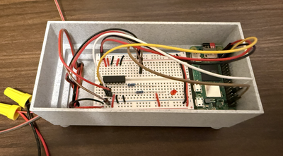

This project runs a spider with LED eyes controlled by a motion sensor.

It monitors the motion sensor and when new motion is detected
turns the LEDs on for a few seconds, then turns them off
and waits for the next motion detection.

The project can be run either as a standalone app or installed as a system
service that restarts on failure or reboot.

# Materials

Raspberry Pi Zero 2W with a working WiFi connection.

Logic buffer - SN74AHCT125N or equivalent.

10K ohm resistor(s) for logic buffer output enable pullups.

LEDs for the spider eyes.

220 ohm curent limiting resistors for the LEDs .

Motion Sensor - AdaFruit PIR or equivalent.

5V power supply.

Spider model for the LEDs.

A breadboard or protoboard for the logic buffer and pullup resistors.

Wires and or jumpers to connect components.

Enclosures for the motion sensor and raspberry pi / logic buffer.

# Setup

This is the hardware setup for Halloween 2025.  It's OK for under cover
but is far from waterproof.  There is a spider model with LED eyes connected
to a controller which connects to a motion sensor and a 5V power supply.


The controller box has the raspberry pi and the circuit with the logic buffer.
The raspberry pi drives the logic buffer inputs and the stronger logic buffer 
outputs drive the LEDs.
There is a LED and resistor inside the controller box so that it can be
tested without the spider attached.  The current limiting resistors for the
spider's eyes are inside the spider.



To set up the software clone the spider repository and set up a virtual environment.

```
git clone https://github.com/steveroe317/halloween-2025.git
cd halloween-2025
python -m venv env
source env/bin/activate
python -m pip install -r requirements.text
```


# Running the App

The app runs inside a python virual environment.

To run the app, follow these steps:

If not already active, activate the Python virtual environment.

```
cd halloween-2025
source env/bin/activate
```

At the root directory of the halloween-2025 repo, run

```
./src/spider.py
```

The app should now be active. It will print messages when motion
is detected and light up the LEDs.

# Installing the App as a Linux Service

Installing the app as a system service allows it to restart after errors
or after a reboot (such as after a power outage). Follow these steps to
install it as a system service.

Modify the repo's spider.service file for your enviroment.

* Change the WorkingDirectory entry to the spider repo root
* Change the ExecStart entry to env/bin/python within the repo root
* Change User entry from steveroe to the login that will run the app
* Change Group entry from steveroe to the login that will run the app

Copy the modified spider.service file to systemctl's service
directory

```
sudo cp spider.service /etc/systemd/system
```

Make sure the app is not already running. If is, there will be resource
conflicts with the GPIO libraries.

Start the service with this command

```
sudo systemctl start spider.service
```

Check that the service by running

```
sudo systemctl status spider.service
```

systemd logs for the service can be viewd by running

```
journalctl -u spider.service -f
```

Enable the service to start at boot by running

```
sudo systemctl enable spider.service
```

Check that the service is enabled at boot by running

```
sudo systemctl is-enabled spider.service
```

Service startup at boot can be tested by rebooting

```
sudo systemctl reboot
```

The service can be stopped, started, restarted, enabled, or disabled with these
commands

```
sudo systemctl stop spider.service
sudo systemctl start spider.service
sudo systemctl restart spider.service
sudo systemctl enable spider.service
sudo systemctl disable spider.service
```

# References

[Raspberry Pi](https://www.raspberrypi.com) web page.
Hardware, software, and documentation for Raspberry Pi single
board computers and microcontrollers.

Digital Loggers
[IoT Relay page](https://www.digital-loggers.com/iot2.html).

RedHat
[systemctl how-to](https://www.redhat.com/en/blog/linux-systemctl-manage-services)
article.

Medium
[Linux service how-to](https://medium.com/@benmorel/creating-a-linux-service-with-systemd-611b5c8b91d6)
article.
